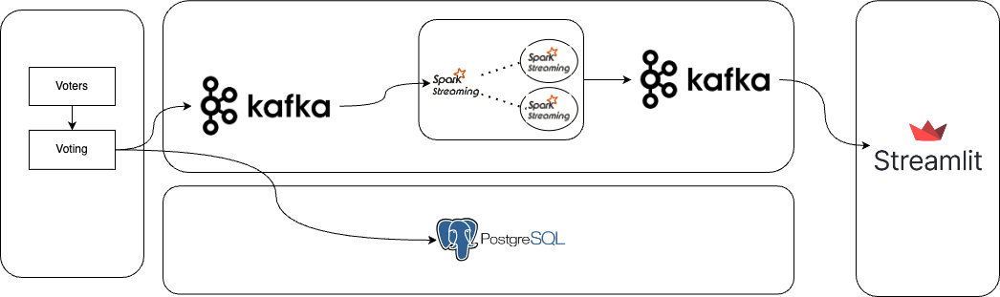

# realtime analysis voting project

## Description
This project is a realtime analysis voting project. It is a simple project that allows users to vote for their favorite candidate and see the results in realtime. The project is built using Python, Spark and Spark-streaming, Kafka, and Streamlit.

## Architecture (image)
here is the architecture of the project:


## files
- `src/generate_voters.py` - This file is used to generate voters and send them to the Kafka broker.
- `src/simulate_voting.py` - This file is used to simulate the voting process after reading the generated voters from the Kafka broker.
- `src/votes_streamlit.py` - This file is used to display the results of the voting process in realtime.
- `jobs/votes_streaming.py` - This file is used to read the generated votes from the Kafka broker and process them using Spark-streaming, and push back the results to the Kafka broker.
- `jobs/submit.sh` - This file is used to submit the Spark job to the Spark cluster.

## Installation
1. Clone the repository
2. Create a virtual environment
3. Install the required packages using the following command:
```bash
pip install -r requirements.txt
```
4. Run the docker-compose file using the following command:
```bash
docker-compose up -d
```
This will start the Kafka broker, postgres_db, and the Spark cluster.

5. Open one terminal and run the following command to start the voter generator:
```bash
python src/generate_voters.py
```
6. Open another terminal and run the following command to start the voting simulation:
```bash
python src/simulate_voting.py
```
7. Inside the spark-master container, run the following command to submit the Spark job:
```bash
bash /jobs/submit.sh
```
8. Open another terminal and run the following command to start the Streamlit app:
```bash
streamlit run src/votes_streamlit.py
```
9. Open your browser and go to `http://localhost:8501` to see the results of the voting process in realtime.
